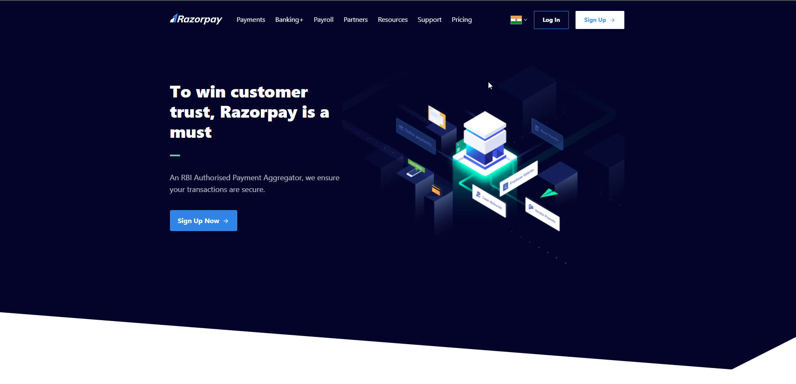
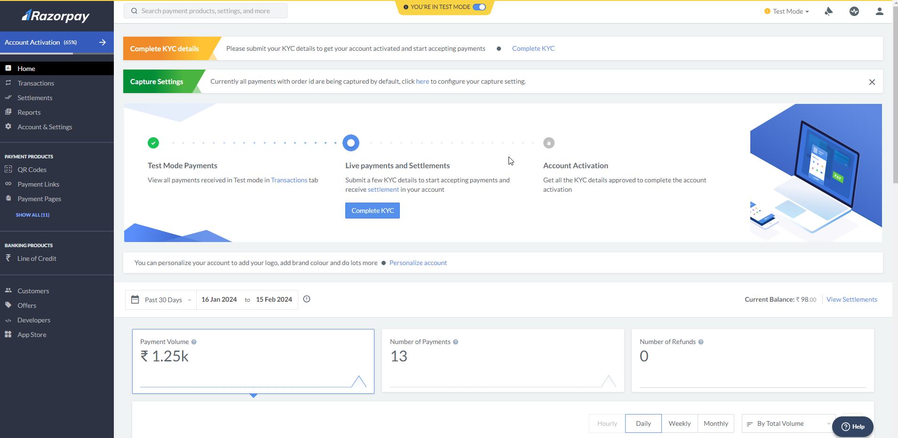
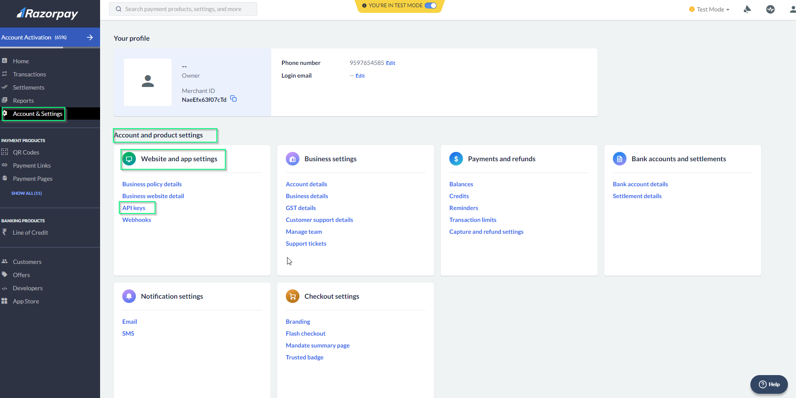
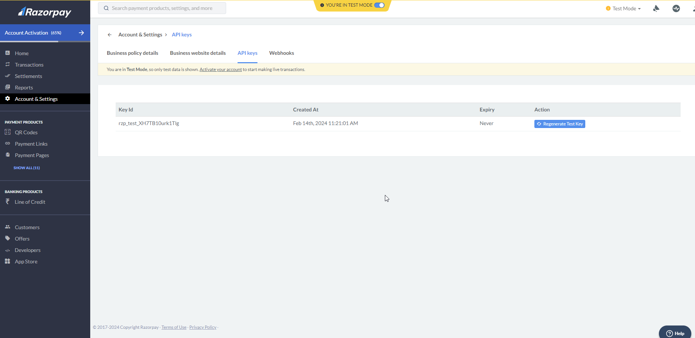
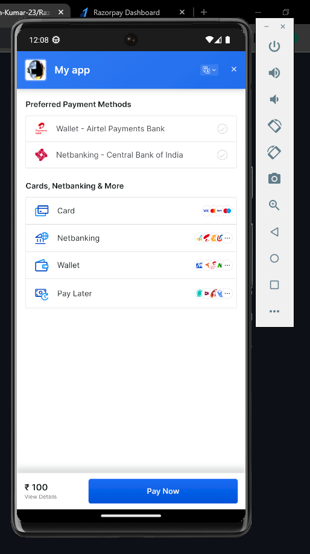

# RAZOR PAY - RN(Android)

Razor pay payment gateway integration with React native app

# Prerequisites

## STEP : 1

Create a RazorPay Account [**Razorpay Account**](https://razorpay.com/?utm_source=google&utm_medium=cpc&utm_campaign=RPSME-RPPerf-GSearchBrand-Prospect-Dweb-Core&utm_adgroup=Core-Misspell-Exact&utm_content=RPSME-Brand-010223&utm_term=razorpay%20com&utm_gclid=Cj0KCQiA5rGuBhCnARIsAN11vgT_PPLWvGhiJNfCPfhjv-48ZegWOJ6KqUZLK6OYUofV2efjbQNk2HQaAu0pEALw_wcB&utm_campaignID=400139470&utm_adgroupID=143652420412&utm_adID=689518700857&utm_network=g&utm_device=c&utm_matchtype=e&utm_devicemodel=&utm_adposition=&utm_location=9298769&gad_source=1&gclid=Cj0KCQiA5rGuBhCnARIsAN11vgT_PPLWvGhiJNfCPfhjv-48ZegWOJ6KqUZLK6OYUofV2efjbQNk2HQaAu0pEALw_wcB)



## Note

For **Live Mode** - Complete KYC, Pan Detail, Phone number, Email, Bank Details and Application requirements like app/web link etc. will be asked.
For **Test** Mode some of above mentioned can be ignored. We will be working on Test Mode.

### After registration Dashboard will appear:



## STEP : 2

Generate API Keys in **Test Mode**. To go live with the integration and start accepting real payments, generate Live **Mode** API Keys and replace them in the integration.

Go to dashboard > Account & Settings > Account and product settings > website and app settings > **API keys**



Generate test key button

### After generate key page will appear:


The secret key will be displayed only once and you won’t be able to find it again, so make a copy of it now. The Test API Key and the Secret key must be kept safe.

# How Payment Gateway Works

Refer : [Know about the](https://razorpay.com/docs/payments/payment-gateway/how-it-works/)

## Install Razorpay React Native SDK

```bash
# using npm
npm install react-native-razorpay --save
```

### On react-native application-side(App.js):

```bash
import React from 'react';
import {View, Text, Button} from 'react-native';
import RazorpayCheckout from 'react-native-razorpay';

const App = () => {
  const amount = 100;
  const currency = 'INR';

  const handlePayment = () => {
    var options = {
      config: {
        display: {
          //show and hide payments method
          show: [{method: 'paylater'}],
          preferences: {show_default_blocks: true},
        },
      },
      description: 'Im buying a Innova car',
      image: 'https://i.imgur.com/3g7nmJC.jpg',
      currency: currency,
      key: 'RAZORPAY_KEY_ID',
      amount: amount * 100,
      name: 'My app',
      order_id: '', //Replace this with an order_id created using Orders API.
      prefill: {
        email: '99msanthosh@gmail.com',
        contact: '9597654585',
        name: 'Santhosh Kumar',
      },

      theme: {color: 'blue'},
    };

    RazorpayCheckout.open(options)
      .then(data => {
        console.log('RESPONSE:', data);
        // handle success
        alert(`Success: ${data.razorpay_payment_id}`);
        console.log(`Payment Id::${data.razorpay_payment_id}`);
      })
      .catch(error => {
        // handle failure
        alert(`Error: ${error.code} | ${error.description}`);
      });
  };

  return (
    <View
      style={{
        flex: 1,
        backgroundColor: 'white',
        justifyContent: 'center',
        alignItems: 'center',
      }}>
      <Text>Hello</Text>
      <Button
        title="Pay Now"
        onPress={() => {
          handlePayment();
        }}
      />
    </View>
  );
};
export default App;
```

### Output:



To learn more about Razorpat payment gateway, take a look at the following resources:

- [Razorpay official website](https://razorpay.com/docs/payments/payment-gateway/react-native-integration/standard/build-integration-android/)

## STEP : 3

[Test Card Details](https://razorpay.com/docs/payments/payments/test-card-details/)

Based on the success/failure response, further functionality can be implemented.
