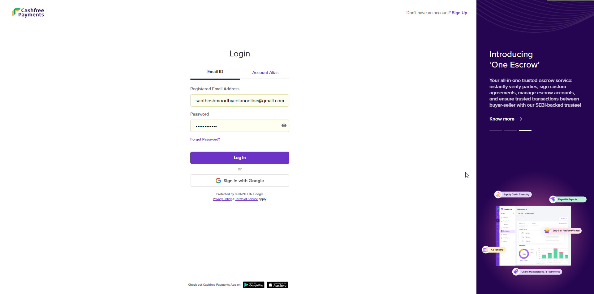
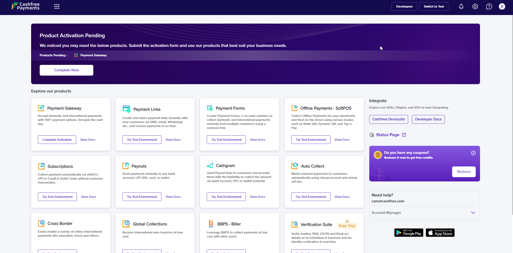
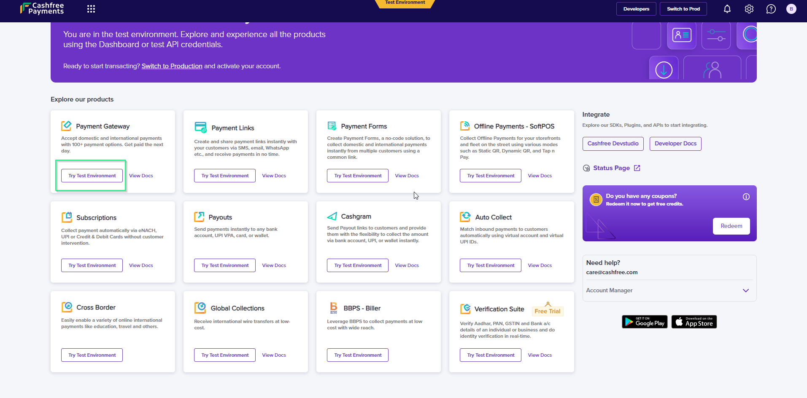
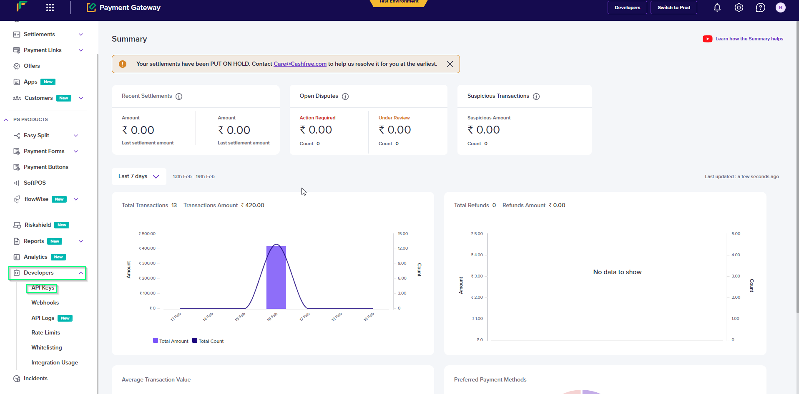
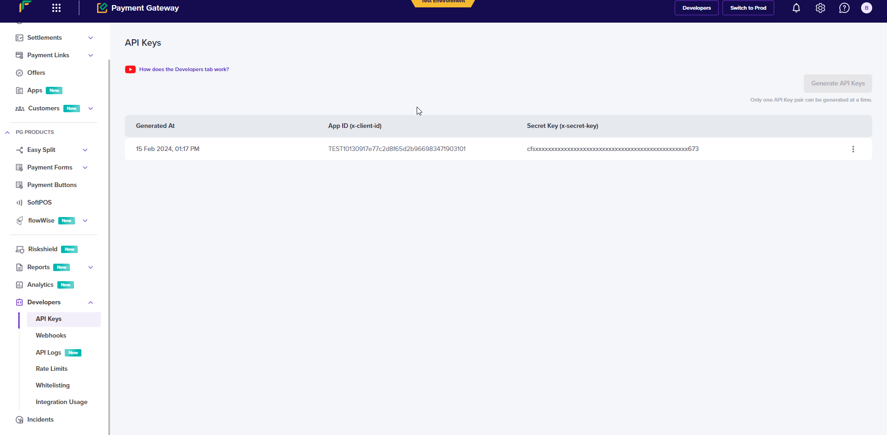

# CASHFREE PAY - RN(Android)

Cashfree pay payment gateway integration with React native app

# Prerequisites

## STEP : 1

To create a account go to the [**Cashfree Payments website and click Create Account**](https://www.cashfree.com/) and fill all the required fields.

### After registration Dashboard will appear:

Choose Switch to Test(tes mode)

choose Try Test Environment

### After choose try test Environment page will appear:

## STEP : 2

Generate API Keys in **Test Mode**.

Choose developer > API Keys > Generate API keys

