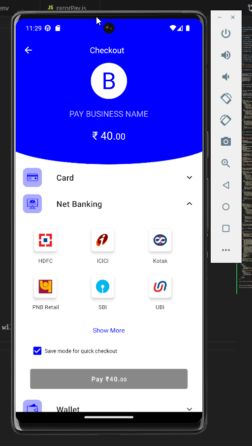

# CASHFREE PAY - RN(Android)

Cashfree pay payment gateway integration with React native app

# Prerequisites

## STEP : 1

To create a account go to the [**Cashfree Payments website and click Create Account**](https://www.cashfree.com/) and fill all the required fields.


### After registration Dashboard will appear:

Choose Switch to Test(test mode)


choose Try Test Environment


### After choose try test Environment page will appear:


## STEP : 2

Generate API Keys in **Test Mode**.

Choose developer > API Keys > Generate API keys


## Install Cahfree pay React Native SDK

```bash
# using npm
npm install react-native-cashfree-pg-sdk --save

npm install cashfree-pg-api-contract
```

Once the installation is complete then open “info.plist” file inside project’s ios folder and add the following code.

```bash

<key>LSApplicationCategoryType</key>
<string></string>
<key>LSApplicationQueriesSchemes</key>
<array>
<string>phonepe</string>
<string>tez</string>
<string>paytmmp</string>
<string>bhim</string>
</array>
```

After adding the above code update pods by running following command
cd ios
pod install — repo-update

## STEP : 3

Next step is to create the order for any payment merchant has to create an order.
Create an order

Cashfree provides 2 API for order creation

1. For production: https://api.cashfree.com/pg/orders
2. For Testing: https://sandbox.cashfree.com/pg/orders

Create order in frontend side

```bash
      //order create
      fetch('https://sandbox.cashfree.com/pg/orders', {
        method: 'POST',
        headers: {
          'Content-Type': 'application/json',
          'x-api-version': '2023-08-01',
          'x-client-id': 'TEST10130917e77c2d8f65d2b966983471903101',
          'x-client-secret':
            'cfsk_ma_test_eb218e66de665a25f457512dfbc9e0aa_04e7b673',
        },
        body: JSON.stringify({
          customer_details: {
            customer_id: 'Customer1',
            customer_phone: '1234567897',
            customer_name: 'Gurusaran',
          },
          order_id: randomOrderIdArray,
          order_amount: 40,
          order_currency: 'INR',
        }),
      })
        .then(response => response.json())
        .then(responseJson => {
          console.log('CREATE ORDER::::', responseJson);
          set_payment_session_id(responseJson?.payment_session_id ?? null);
          // console.log('PAYMENT SESSION ID:::', payment_session_id);
        })
        .catch(e => {
          console.log('CATCH ERROR:::', e);
        });
```

If the order creation is successful we will get the 200 response and all the relevant order details. We will save payments_session_id, order id, cf_order_id and order_status at our end .

follow the following code snippet

```bash
      import React, {useEffect, useState} from 'react';
import {View, SafeAreaView, StatusBar, Button, Text, Alert} from 'react-native';
import {
  CFErrorResponse,
  CFPaymentGatewayService,
} from 'react-native-cashfree-pg-sdk';
import {
  CFEnvironment,
  CFSession,
  CFPaymentComponentBuilder,
  CFPaymentModes,
  CFDropCheckoutPayment,
  CFThemeBuilder,
} from 'cashfree-pg-api-contract';
import {useFocusEffect} from '@react-navigation/native';

const CasfFreePayment = () => {
  const [randomOrderId, setRandomOrderId] = useState(0);
  const [payment_session_id, set_payment_session_id] = useState(null);

  useFocusEffect(
    React.useCallback(() => {
      //Generate Random alphanumeric
      var array =
        'ABCDEFGHIJKLMNOPQRSTUVWXYZabcdefghijklmnopqrstuvwxyz0123456789';
      var len = 10;

      const randomOrderIdArray = [...Array(len)].reduce(
        a => a + array[~~(Math.random() * array.length)],
        '',
      );
      console.log('AAAAAAAAAA', randomOrderId);
      setRandomOrderId(randomOrderIdArray);

      //order create
      fetch('https://sandbox.cashfree.com/pg/orders', {
        method: 'POST',
        headers: {
          'Content-Type': 'application/json',
          'x-api-version': '2023-08-01',
          'x-client-id': 'TEST10130917e77c2d8f65d2b966983471903101',
          'x-client-secret':
            'cfsk_ma_test_eb218e66de665a25f457512dfbc9e0aa_04e7b673',
        },
        body: JSON.stringify({
          customer_details: {
            customer_id: 'Customer1',
            customer_phone: '1234567897',
            customer_name: 'Gurusaran',
          },
          order_id: randomOrderIdArray,
          order_amount: 40,
          order_currency: 'INR',
        }),
      })
        .then(response => response.json())
        .then(responseJson => {
          console.log('CREATE ORDER::::', responseJson);
          set_payment_session_id(responseJson?.payment_session_id ?? null);
          // console.log('PAYMENT SESSION ID:::', payment_session_id);
        })
        .catch(e => {
          console.log('CATCH ERROR:::', e);
        });
    }, []),
  );

  useEffect(() => {
    CFPaymentGatewayService.setCallback({
      onVerify(orderID) {
        fetch(`https://sandbox.cashfree.com/pg/orders/${orderID}`, {
          method: 'GET',
          headers: {
            'Content-Type': 'application/json',
            'x-api-version': '2023-08-01',
            'x-client-id': 'TEST10130917e77c2d8f65d2b966983471903101',
            'x-client-secret':
              'cfsk_ma_test_eb218e66de665a25f457512dfbc9e0aa_04e7b673',
          },
        })
          .then(res => res.json())
          .then(jsonRes => {
            console.log('JSONRES:::', jsonRes);
          })
          .catch(e => {
            console.log('CATCH ERROR::::', e);
          });
      },
      onError(CFErrorResponse, orderID) {
        console.log('failed ', orderID);
      },
    });
    return () => CFPaymentGatewayService.removeCallback();
  }, []);

  const startCheckout = () => {
    try {
      const session = new CFSession(
        payment_session_id,
        randomOrderId,
        CFEnvironment.SANDBOX,
      );

      const paymentModes = new CFPaymentComponentBuilder()
        .add(CFPaymentModes.CARD)
        .add(CFPaymentModes.UPI)
        .add(CFPaymentModes.NB)
        .add(CFPaymentModes.WALLET)
        .add(CFPaymentModes.PAY_LATER)
        .build();
      const theme = new CFThemeBuilder()
        .setNavigationBarBackgroundColor('blue')
        .setNavigationBarTextColor('#FFFFFF')
        .setButtonBackgroundColor('blue')
        .setButtonTextColor('#FFFFFF')
        .setPrimaryTextColor('#212121')
        .setSecondaryTextColor('#757575')
        .build();
      const dropPayment = new CFDropCheckoutPayment(
        session,
        paymentModes,
        theme,
      );
      CFPaymentGatewayService.doPayment(dropPayment);
    } catch (e) {
      console.log(e.message);
    }
  };
  return (
    <View
      style={{
        flex: 1,
        justifyContent: 'center',
        alignItems: 'center',
      }}>
      <Text style={{fontSize: 15, marginBottom: 10}}>Cashfree pay</Text>
      <Button
        title="Pay Now"
        onPress={() => {
          startCheckout();
        }}
      />
    </View>
  );
};

export default CasfFreePayment;

```

### Output:

Now Call the startCheckout function and pass the payment_session_id and order_id in the session object and then you will be able to make payments from the SDK.

After calling the startCheckout function you will be redirected to the following screen



### Refer

- [Cashfree SDK integration in React Native App](https://medium.com/vectoscalar/cashfree-sdk-integration-in-react-native-app-cba7fa9f2b2)
